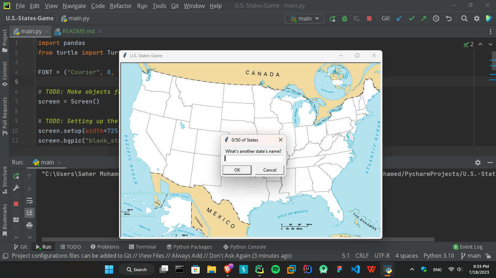
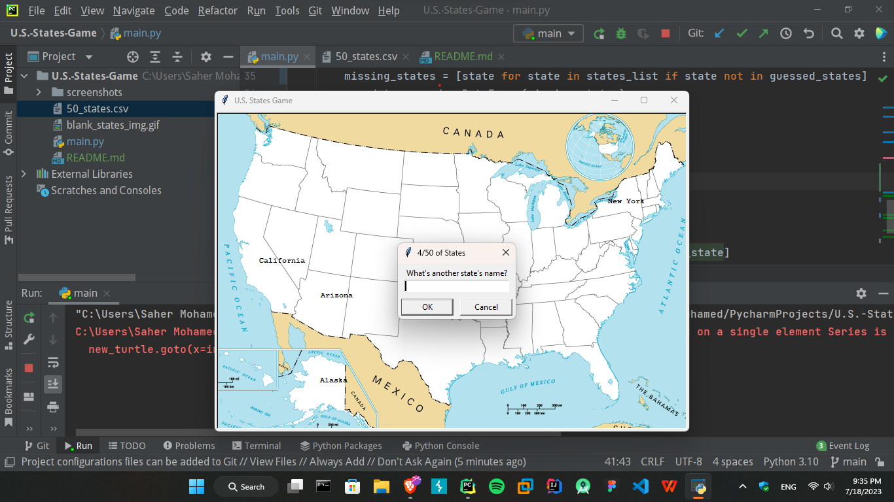

# Python Data Science Project: U.S. States Game
This is a Python data science project that allows you to play a game to guess the names of U.S. states on a map. It utilizes the turtle module for graphics and the pandas library for data manipulation.

## Project Overview
The objective of this project is to guess the names of all 50 U.S. states by clicking on their corresponding locations on a map. The game will prompt you to enter the name of a state, and if you guess correctly, the program will mark the state on the map using a turtle object. The game continues until you have correctly guessed all 50 states or choose to exit.

## Prerequisites
Before running the project, ensure that you have the following:
- Python **3.x** installed
- Required libraries: `pandas`

## How to Play
- The game will display a map of the United States with all states labeled as blanks.
- The program will prompt you to enter the name of a state. Enter the full name of a U.S. state and press Enter.
- If your guess is correct, the program will mark the state on the map and move to the next state.
- Repeat steps 2-3 until you have correctly guessed all 50 states or want to exit the game.
- To exit the game, enter "Exit" when prompted for a state name. The program will generate a CSV file named "remaining_states.csv" containing the names of the states you have not yet guessed.
- lose the game window by clicking anywhere on the map.

## Screenshots

## Data Source
The project utilizes the `50_states.csv` file, which contains the names and coordinates of all 50 U.S. states. This file is used to identify the correct locations to mark on the map when a state is guessed correctly.

## Acknowledgements
- The turtle graphics library provides the functionality to draw on the screen and interact with user input.
- The `pandas` library is used for reading and manipulating the "50_states.csv" file.

**Note**: The project currently contains commented code (lines 31-37 and lines 43-46). Feel free to uncomment and modify the code as needed to enhance or customize the project.  
**Disclaimer**: This project is intended for educational purposes and does not represent a comprehensive or accurate representation of the United States or its states.  
Feel free to modify and improve upon this project! Happy gaming!